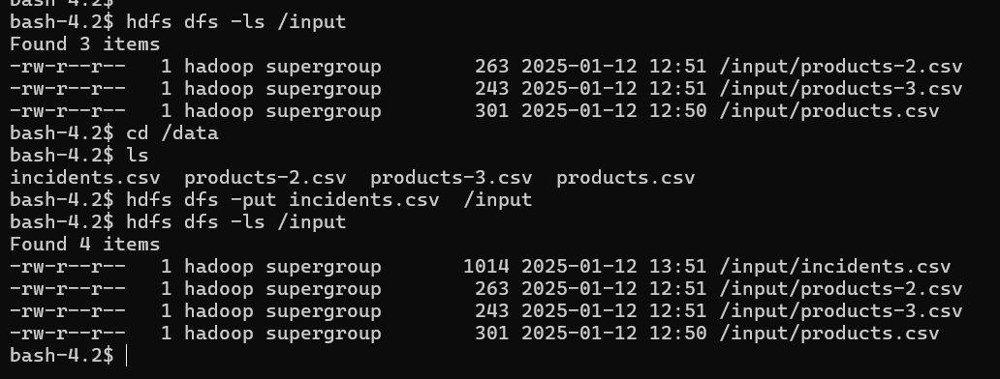
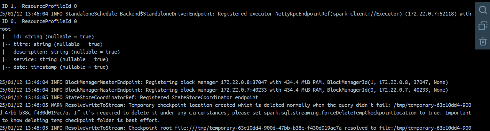

# TP Apache Spark : Analyse des Incidents Hospitaliers

## Objectif

L'objectif de ce TP était de développer une application Apache Spark Structured Streaming pour :

- Lire les incidents de l'hôpital en streaming à partir de fichiers CSV.
- Afficher de manière continue le nombre d'incidents par service.
- Afficher de manière continue les deux années où il y a eu le plus d'incidents.

---

## Structure du Projet

### Fichiers Principaux

- **`incidents.csv`** : Fichier CSV contenant les données des incidents.
- **`HospitalStreamsQ1.java`** : Classe principale pour Afficher le nombre d'incidents par service.
- **`HospitalStreamsQ2.java`** : Classe principale pour  afficher les deux années où il y a eu le plus d'incidents .
- **`docker-compose.yml`** : Fichier de configuration pour Docker Compose.
### Données

Le fichier `incidents.csv` contient les colonnes suivantes :

- `Id` : Identifiant unique de l'incident.
- `titre` : Titre de l'incident.
- `description` : Description détaillée de l'incident.
- `service` : Service de l'hôpital concerné par l'incident.
- `date` : Date et heure de l'incident.

**Exemple de contenu :**

```csv
id,title,description,service,date
1,Equipment failure,The monitor in operating room 2 is not working.,Operating Room,2023-10-01 08:15:00
2,Delivery delay,Medications for the pharmacy did not arrive on time.,Pharmacy,2023-10-01 09:30:00
3,Air conditioning issue,The air conditioning in room 101 is not working.,Maintenance,2023-10-02 14:20:00
4,Dosage error,A patient received an incorrect dose of medication.,Pharmacy,2023-10-03 10:45:00
5,Network issue,The Wi-Fi network is down across the hospital.,IT,2023-10-03 16:00:00
6,Staff shortage,Not enough nurses in the emergency department.,Emergency,2023-10-04 07:50:00
7,Electrical issue,Power outage in the radiology department.,Maintenance,2023-10-04 12:10:00
8,Record error,A patient's medical record cannot be found.,Administration,2023-10-05 11:30:00
9,Elevator breakdown,Elevator B is stuck on the 3rd floor.,Maintenance,2023-10-05 15:45:00
10,Appointment delay,A patient waited over an hour for their appointment.,Consultation,2023-10-06 09:00:00
```

### docker-compose :
````dockerfile
version: '3'
services:
  namenode:
      image: apache/hadoop:3.3.6
      hostname: namenode
      command: ["hdfs", "namenode"]
      ports:
        - 9870:9870
        - 8020:8020
      env_file:
        - ./config
      environment:
          ENSURE_NAMENODE_DIR: "/tmp/hadoop-root/dfs/name"
      volumes:
        - ./volumes/namenode:/data
      networks:
        - spark-network
  datanode:
      image: apache/hadoop:3.3.6
      command: ["hdfs", "datanode"]
      env_file:
        - ./config      
      networks:
        - spark-network
  resourcemanager:
      image: apache/hadoop:3.3.6
      hostname: resourcemanager
      command: ["yarn", "resourcemanager"]
      ports:
         - 8088:8088
      env_file:
        - ./config

      volumes:
        - ./test.sh:/opt/test.sh
      networks:
        - spark-network
  nodemanager:
      image: apache/hadoop:3.3.6
      command: ["yarn", "nodemanager"]
      env_file:
        - ./config
      networks:
        - spark-network
  spark-master:
    image: bitnami/spark:latest
    container_name: spark-master
    environment:
      - SPARK_MODE=master
      - SPARK_MASTER_PORT=7077
      - SPARK_MASTER_WEBUI_PORT=8080
      - SPARK_DAEMON_MEMORY=1g 
    ports:
      - "7077:7077"
      - "8080:8080"
    volumes:
      - ./volumes/spark-master:/bitnami
    networks:
      - spark-network
  spark-worker-1:
    image: bitnami/spark:latest
    container_name: spark-worker-1
    environment:
      - SPARK_MODE=worker
      - SPARK_MASTER_URL=spark://spark-master:7077
      - SPARK_WORKER_MEMORY=1g  
      - SPARK_WORKER_WEBUI_PORT=4040
    depends_on:
      - spark-master
    volumes:
      - ./volumes/spark-worker-1:/bitnami
    ports:
      - "4040:4040"  
    networks:
      - spark-network
  spark-worker-2:
    image: bitnami/spark:latest
    container_name: spark-worker-2
    environment:
      - SPARK_MODE=worker
      - SPARK_MASTER_URL=spark://spark-master:7077
      - SPARK_WORKER_MEMORY=1g 
      - SPARK_WORKER_WEBUI_PORT=4040
    depends_on:
      - spark-master
    volumes:
      - ./volumes/spark-worker-2:/bitnami
    ports:
      - "4140:4040"  
    networks:
      - spark-network

networks:
  spark-network:
    driver: bridge
    
````
- **Démarrer le cluster Docker**
    - `docker-compose up -d`
- **Ajouter des fichiers CSV à HDFS**

</br>

- **Soumettre l'application Spark**



# Résultats
## 1. Nombre d'incidents par service


## 2. Deux années avec le plus d'incidents

